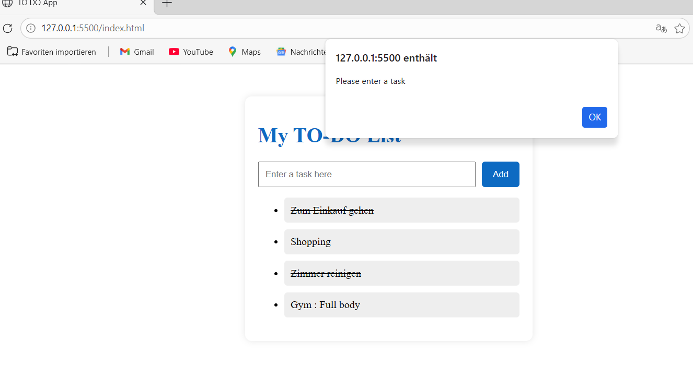

# TypeScript To-Do App

This is a simple To-Do application built with TypeScript, HTML, and CSS.

## Purpose
This project was created to explore the difference between JavaScript and TypeScript, especially type safety and structured code.

## Features
- Add tasks
- Mark tasks as completed
- Dynamic UI rendering

## Key Concepts
- TypeScript interfaces for data structure
- DOM manipulation
- Event handling
- State and UI synchronization

## Technologies
- TypeScript
- HTML
- CSS

### Overview

